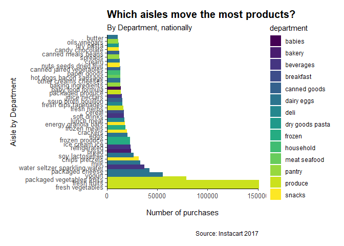
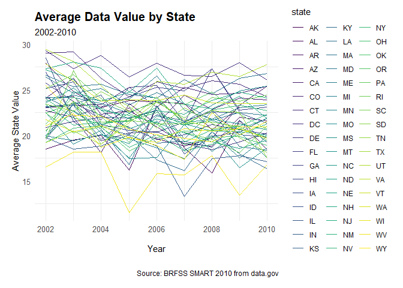
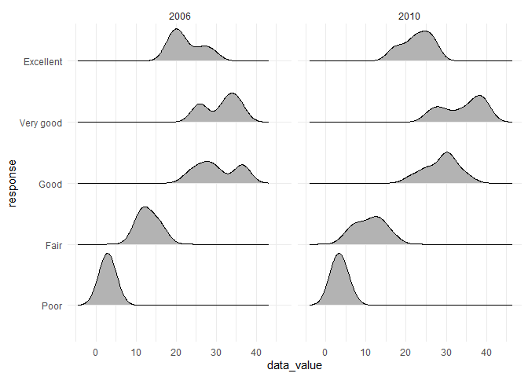
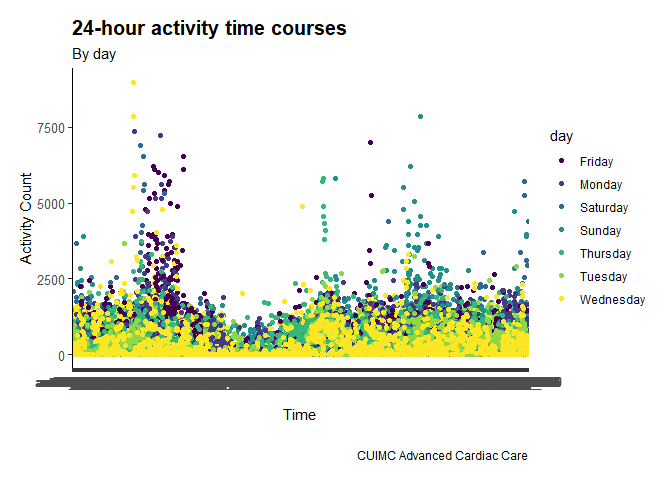

p8105\_hw3\_br2598
================
Brandon Rojas
10/17/2021

## Problem 1 - Instacart Online Grocery Shopping Dataset 2017

The goal is to do some exploration of this dataset. To that end:

\*\* (i) write a short description of the dataset, noting the size and
structure of the data, describing some key variables, and giving
illustrative examples of observations. Then, do or answer the following
(commenting on the results of each):

Instacart is an online grocery service that connects shoppers to local
grocery stores. The ***Instacart*** dataset has 15 variables and 1384617
observations, representing over 3M orders for 200K Instacart users.

The dataset is atbl, and and contains information on the types of
products sold, organized by “aisles” and departments based on those
generally found in supermarkets.

From these one can infer customer behaviors using the “user\_id” column,
and, in the non-anonymoized version, the user demographics (i.e. men
aged 21-28 are more likely to buy pizza on a Friday after 7pm).

``` r
aisle_count <- instacart %>% 
  janitor::clean_names() %>%
  group_by(aisle, department) %>% 
  summarize(
    n_obs = n())
```

    ## `summarise()` has grouped output by 'aisle'. You can override using the `.groups` argument.

``` r
dept_count <- instacart %>% 
  janitor::clean_names() %>%
  group_by(department) %>% 
  summarize(
    n_obs = n())

top_aisles = sort(table(instacart$aisle), decreasing = TRUE)[1:5] #find a way to do with count()
```

**a) How many aisles are there? Which aisles are most items ordered
from? **

There are 134 aisles, 21 departments, and the top aisles are 150609,
150473, 78493, 55240, 41699

The top five aisles are fresh vegetables, fresh fruits, packaged
vegetables and fruits, yogurt and packaged cheese.

**b) Make a plot that shows the number of items ordered in each aisle,
limiting this to aisles with more than 10000 items ordered. Arrange
aisles sensibly, and organize your plot so others can read it. **

There are 39 aisles with greater than 10K items ordered.

``` r
aisle_subten <- aisle_count %>% 
  filter(n_obs > 10000)

#best attempt chart. Make sure it displays right it github_document..
aisle_subten %>%
  ggplot(aes(x = reorder(aisle, -n_obs), y = n_obs, fill = department)) +
  geom_col(aes(color = department), size = 1) +
  #scale_fill_brewer(palette = "Dark") +
  scale_y_continuous(expand = c(0, 0.1)) +
  coord_flip() +
  #facet_grid(rows = vars(department), scales = "free_y", switch = "y", space = "free_y") +
  labs(
    title = "Which aisles move the most products?",
    subtitle = "By Department, nationally",
    caption = "Source: Instacart 2017",
    y = "Number of purchases",
    x = "Aisle by Department"
  ) +
  theme_classic() +
  theme(
    plot.margin = margin(0.5, 0.5, 0.5, 0.5, unit = "cm"),
    plot.title = element_text(size = 15, face = "bold"),
    strip.text.y = element_text(angle = 270, face = "bold"),
    strip.placement = "outside",
    axis.title.x = element_text(margin = margin(t = 0.5, b = 0.5, unit = "cm")),
    axis.text = element_text(size = 10),
    legend.position = "right",
    panel.grid.major.y = element_blank(),
    )
```

<!-- -->

**c) Make a table showing the three most popular items in each of the
aisles “baking ingredients”, “dog food care”, and “packaged vegetables
fruits”. Include the number of times each item is ordered in your
table.**

``` r
top_3_items <- instacart %>% 
  janitor::clean_names() %>%
  group_by(aisle, product_name) %>%
  filter(aisle %in% c("baking ingredients", "dog food care", "packaged vegetables fruits")) %>%
  summarize(number_of_orders = n()) %>%
  arrange(desc(number_of_orders)) %>% 
  slice(1:3)
```

    ## `summarise()` has grouped output by 'aisle'. You can override using the `.groups` argument.

``` r
top_3_items
```

    ## # A tibble: 9 x 3
    ## # Groups:   aisle [3]
    ##   aisle                      product_name                       number_of_orders
    ##   <chr>                      <chr>                                         <int>
    ## 1 baking ingredients         Light Brown Sugar                               499
    ## 2 baking ingredients         Pure Baking Soda                                387
    ## 3 baking ingredients         Cane Sugar                                      336
    ## 4 dog food care              Snack Sticks Chicken & Rice Recip~               30
    ## 5 dog food care              Organix Chicken & Brown Rice Reci~               28
    ## 6 dog food care              Small Dog Biscuits                               26
    ## 7 packaged vegetables fruits Organic Baby Spinach                           9784
    ## 8 packaged vegetables fruits Organic Raspberries                            5546
    ## 9 packaged vegetables fruits Organic Blueberries                            4966

**d) Make a table showing the mean hour of the day at which Pink Lady
Apples and Coffee Ice Cream are ordered on each day of the week; format
this table for human readers (i.e. produce a 2 x 7 table). **

``` r
# For recoding lady apple
# Instead of hardcoding the days
# Use a dataframe for 0-6 and sunday-saturday then do a join of the two
#day_df <- c((0:6), "Sunday", "Monday", "Tuesday", "Wednesday", "Thursday", "Friday", "Saturday")

pink_coffee <- instacart %>% 
  janitor::clean_names() %>%
  group_by(product_name, order_dow) %>%
  filter(product_name %in% c("Pink Lady Apples", "Coffee Ice Cream")) %>%
  summarize(m_hour = mean(order_hour_of_day)) %>%
  mutate(order_dow = recode(order_dow, `0` = "Sunday", `1` = "Monday", `2` = "Tuesday", `3`="Wednesday", `4` = "Thursday", `5` = "Friday", `6` = "Saturday")) %>%
  pivot_wider(
    names_from = "order_dow",
    values_from = "m_hour") %>%
  knitr::kable(digits = 2) # 2 sigfig
```

    ## `summarise()` has grouped output by 'product_name'. You can override using the `.groups` argument.

``` r
pink_coffee  
```

| product\_name    | Sunday | Monday | Tuesday | Wednesday | Thursday | Friday | Saturday |
|:-----------------|-------:|-------:|--------:|----------:|---------:|-------:|---------:|
| Coffee Ice Cream |  13.77 |  14.32 |   15.38 |     15.32 |    15.22 |  12.26 |    13.83 |
| Pink Lady Apples |  13.44 |  11.36 |   11.70 |     14.25 |    11.55 |  12.78 |    11.94 |

## Problem 2

First, do some data cleaning:

\*\* a) format the data to use appropriate variable names; focus on the
“Overall Health” topic include only responses from “Excellent” to “Poor”
organize responses as a factor taking levels ordered from “Poor” to
“Excellent”

``` r
#Cleaning the data by adding in States and removing extra text from County.
brfss_clean_2010<- brfss_smart2010 %>% janitor::clean_names() %>%
  rename(state = locationabbr) %>%
  rename(county = locationdesc) %>%
  filter(question_id %in% c("GENHLTH")) %>%
  mutate(county = gsub("^.{0,5}", "", county)) #sprinkle some regex to remove first 5 characters from every location description 
  
brfss_clean_2010$response <- factor(brfss_clean_2010$response, levels = c("Poor", "Fair", "Good", "Very good", "Excellent"), ordered = TRUE)
```

Using this dataset, do or answer the following (commenting on the
results of each):

2.  In 2002, which states were observed at 7 or more locations? What
    about in 2010?

``` r
brfss_seven_2002 <- brfss_clean_2010 %>% 
  filter(year %in% c("2002")) %>% 
  group_by(state, geo_location)  #%>% filter(n(length(unique(GeoLocation))) > 7)

brfss_seven_2010 <- brfss_clean_2010 %>% 
  filter(year %in% c("2010")) %>% 
  group_by(state, geo_location) #%>% filter(n(length(unique(GeoLocation))) > 7)
```

Find states with in 2002 with 7 or more unique geolocations. Repeat for
2010, use inline r.

3.  Construct a dataset that is limited to Excellent responses, and
    contains, year, state, and a variable that averages the data\_value
    across locations within a state.

``` r
excellent_brfss <- brfss_clean_2010 %>% 
  filter(response %in% c("Excellent")) %>% 
  group_by(state, year) %>%
  mutate(avg_state_value = mean(data_value)) %>%
  select(year, state, avg_state_value) %>%  distinct()
```

4.  Make a “spaghetti” plot of this average value over time within a
    state (that is, make a plot showing a line for each state across
    years – the geom\_line geometry and group aesthetic will help).

``` r
p <- ggplot(data = excellent_brfss, aes(x = year, y = avg_state_value, group = state)) + 
  geom_line(aes(color = state)) +
    labs(
    title = "Average Data Value by State",
    subtitle = "2002-2010",
    caption = "Source: BRFSS SMART 2010 from data.gov",
    y = "Average State Value",
    x = "Year"
  ) +
  #theme_minimal(base_family = "Arial") +
  theme_minimal() +
  theme(
    plot.margin = margin(0.5, 0.5, 0.5, 0.5, unit = "cm"),
    plot.title = element_text(size = 15, face = "bold"),
    strip.text.y = element_text(angle = 270, face = "bold"),
    strip.placement = "outside",
    axis.title.x = element_text(margin = margin(t = 0.5, b = 0.5, unit = "cm")),
    axis.text = element_text(size = 10),
    legend.position = "right",
    panel.grid.major.y = element_blank(),
    )
p
```

    ## Warning: Removed 3 row(s) containing missing values (geom_path).

<!-- -->

5.  Make a two-panel plot showing, for the years 2006, and 2010,
    distribution of data\_value for responses (“Poor” to “Excellent”)
    among locations in NY State.

``` r
brfss_2006_2010 <- brfss_clean_2010 %>%  
  filter(year %in% c("2006" , "2010"), state %in% c("NY"))

p_graded_values <- ggplot(brfss_2006_2010, aes(x = data_value, y = response)) +
   geom_density_ridges(scale = .85) +
   facet_grid(~year)

p_graded_values
```

    ## Picking joint bandwidth of 2.1

    ## Picking joint bandwidth of 2.03

<!-- -->

## Problem 3

Accelerometers have become an appealing alternative to self-report
techniques for studying physical activity in observational studies and
clinical trials, largely because of their relative objectivity. During
observation periods, the devices measure “activity counts” in a short
period; one-minute intervals are common. Because accelerometers can be
worn comfortably and unobtrusively, they produce around-the-clock
observations.

This problem uses five weeks of accelerometer data collected on a 63
year-old male with BMI 25, who was admitted to the Advanced Cardiac Care
Center of Columbia University Medical Center and diagnosed with
congestive heart failure (CHF). The data can be downloaded here. In this
spreadsheet, variables activity.\* are the activity counts for each
minute of a 24-hour day starting at midnight.

1.  Your final dataset should include all originally observed variables
    and values; have useful variable names; include a weekday vs weekend
    variable; and encode data with reasonable variable classes.

<!-- -->

1.  Load, tidy, and otherwise wrangle the data. Your final dataset
    should include all originally observed variables and values; have
    useful variable names; include a weekday vs weekend variable; and
    encode data with reasonable variable classes. Describe the resulting
    dataset (e.g. what variables exist, how many observations, etc).

``` r
accel_data = read_csv(file = "./data/accel_data.csv")
```

    ## Rows: 35 Columns: 1443

    ## -- Column specification --------------------------------------------------------
    ## Delimiter: ","
    ## chr    (1): day
    ## dbl (1442): week, day_id, activity.1, activity.2, activity.3, activity.4, ac...

    ## 
    ## i Use `spec()` to retrieve the full column specification for this data.
    ## i Specify the column types or set `show_col_types = FALSE` to quiet this message.

``` r
tidy_accel <- accel_data %>% 
  janitor::clean_names() %>%
  pivot_longer(
    activity_1:activity_1440,
    names_to = "minute",
    values_to = "activity")
```

2.  Describe the resulting dataset (e.g. what variables exist, how many
    observations, etc).

The accel\_data dataset records the accelerometer activity of a single
63yr male with BMI 25, a patient diagnosed with CHF at the Advanced
Cardiac Care. The ***accel\_data*** dataset has 1443 variables and 35
observations, representing the man’s motions throughout each minute of a
day of 35 days. The dataset is atbl\_df.

3.  Traditional analyses of accelerometer data focus on the total
    activity over the day. Using your tidied dataset, aggregate accross
    minutes to create a total activity variable for each day, and create
    a table showing these totals. Are any trends apparent?

``` r
#total_activity_score = sum(tidy_accel$activity, na.RM = TRUE)

aggr_minutes <- tidy_accel %>% 
  group_by(day) %>% 
  summarize((total_activity_score = sum(activity, na.RM = TRUE))) %>%
  knitr::kable() #does sigfig matter..?
```

4.  Accelerometer data allows the inspection activity over the course of
    the day. Make a single-panel plot that shows the 24-hour activity
    time courses for each day and use color to indicate day of the week.
    Describe in words any patterns or conclusions you can make based on
    this graph.

``` r
# tip from TA "When using pivot_longer names should be minute, so output is continuous..."
breaks = seq(from = 0, to = 1440, by = 240)
labels = c("0", "4", "8", "12", "16", "20", "24")

p_accel_24hr <- tidy_accel %>% 
  group_by(day, minute) %>%
  ggplot(aes(x = minute, y = activity, color = day)) + #tried shape but ran out of usable shapes at 5?
  geom_point() +
  labs(
    title = "24-hour activity time courses",
    subtitle = "By day",
    caption = "CUIMC Advanced Cardiac Care",
    y = "Activity Count",
    x = "Time"
  ) + 
  #scale_x_continuous(breaks, labels) + couldnt get working
  theme_classic() +
  theme(
    plot.margin = margin(0.5, 0.5, 0.5, 0.5, unit = "cm"),
    plot.title = element_text(size = 15, face = "bold"),
    strip.text.y = element_text(angle = 270, face = "bold"),
    strip.placement = "outside",
    axis.title.x = element_text(margin = margin(t = 0.5, b = 0.5, unit = "cm")),
    axis.text = element_text(size = 10),
    legend.position = "right",
    panel.grid.major.y = element_blank(),
    )

p_accel_24hr
```

<!-- -->
